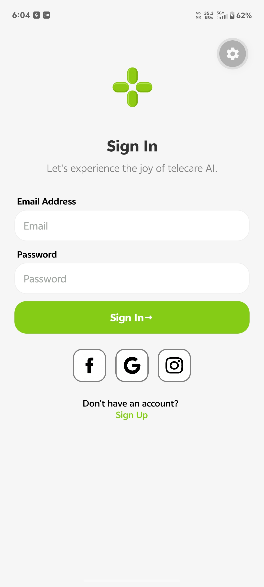
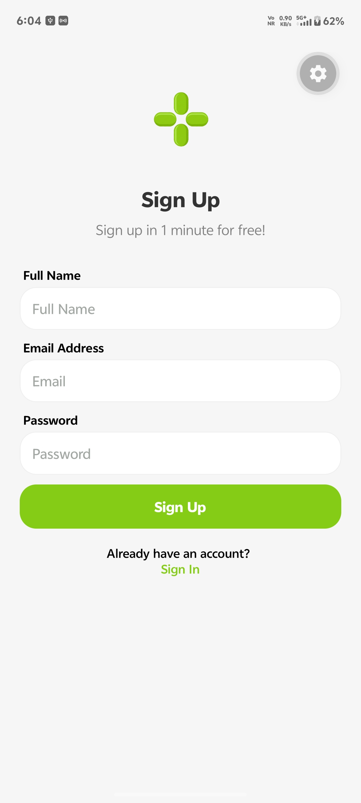

# Chai Code Mobile

A React Native telecare application built with Expo Router, featuring AI-powered healthcare services.

## Features

- **Authentication** - Sign in and Sign up screens with email/password
- **Social Login** - Facebook, Google, and Instagram authentication options
- **Telecare AI** - AI-powered healthcare consultation
- **Responsive Design** - Mobile-first UI with smooth focus animations

## Screenshots

### Sign In


### Sign Up


## Tech Stack

- **Framework**: Expo SDK with React Native
- **Routing**: Expo Router (file-based routing)
- **Styling**: StyleSheet with custom color palette
- **Icons**: Local PNG assets (Facebook, Google, Instagram)

## Color Palette

| Name | Hex Code | Usage |
|------|----------|-------|
| Primary | `#85CC17` | Buttons, links, accents |
| Background | `#F6F6F6` | Screen background |
| Surface | `#FFFFFF` | Input fields, cards |
| Border | `#EFEFEF` | Input borders |
| Text Secondary | `#A2A7A3` | Placeholder text |

## Getting Started

1. Install dependencies
   ```bash
   npm install
   ```

2. Start the app
   ```bash
   npx expo start
   ```

3. Open in:
   - [Development build](https://docs.expo.dev/develop/development-builds/introduction/)
   - [Android emulator](https://docs.expo.dev/workflow/android-studio-emulator/)
   - [iOS simulator](https://docs.expo.dev/workflow/ios-simulator/)
   - [Expo Go](https://docs.expo.dev/get-started/expo-go/)

## Project Structure

```
src/app/           # Expo Router pages (file-based routing)
  index.tsx        # Sign In screen
  SignUp.tsx       # Sign Up screen
  _layout.tsx      # Root layout

assets/images/     # App images and icons
```

## App Screens

### Sign In
- Email and password input with focus animations
- Primary action button with arrow indicator
- Social login buttons (Facebook, Google, Instagram)
- Link to Sign Up screen

### Sign Up
- Full name, email, and password fields
- Focus state animations matching Sign In
- Link back to Sign In screen

## Learn More

- [Expo documentation](https://docs.expo.dev/)
- [Expo Router introduction](https://docs.expo.dev/router/introduction/)
- [React Native documentation](https://reactnative.dev/)